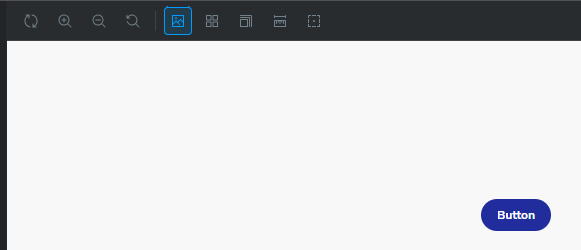
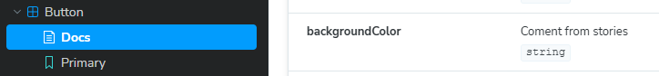

# Instalación

1. Comenzamos un proyecto de React con Vite + TS.

```bash
pnpm create vite@latest
```

2. Instalamos Storybook.

```bash
pnpm dlx storybook@latest init
```

3. El proyecto lanzara storybook de forma automática después de su instalación, pero para iniciarlo manualmente, ejecutamos:

```bash
pnpm storybook
```

4. Notaremos que se creo una carpeta .storybook el cuál contiene dos archivos, main.ts y preview.ts.

# Analizando archivos de Storybook

## main.ts

Este archivo es una configuración de Storybook para un proyecto que utiliza **React** con **Vite**. Vamos a analizar cada sección del archivo:

### **1. Importación de tipos**
```typescript
import type { StorybookConfig } from "@storybook/react-vite";
```
- **`StorybookConfig`**: Es el tipo que define la estructura esperada para la configuración de Storybook. Importarlo ayuda a garantizar que el objeto `config` cumpla con el formato esperado, proporcionando validación de tipos y autocompletado al usar TypeScript.
- **`@storybook/react-vite`**: Es el paquete que adapta Storybook para trabajar con React y Vite, optimizando el rendimiento y la integración.

---

### **2. Definición de la configuración**
```typescript
const config: StorybookConfig = { ... };
```
- Aquí se define el objeto `config`, que contiene toda la información necesaria para que Storybook funcione correctamente en el proyecto.

---

### **3. Propiedades del objeto `config`**

#### a. **`stories`**
```typescript
stories: ["../src/**/*.mdx", "../src/**/*.stories.@(js|jsx|mjs|ts|tsx)"],
```
- Define la ubicación de los archivos de historias para Storybook. 
- **Valor:**
  - `"../src/**/*.mdx"`: Busca archivos con extensión `.mdx` en cualquier subdirectorio dentro de `src`. Los archivos `.mdx` combinan Markdown con componentes de React, ideales para documentar componentes junto con sus historias.
  - `"../src/**/*.stories.@(js|jsx|mjs|ts|tsx)"`: Busca archivos con extensiones relacionadas con JavaScript o TypeScript que tengan `.stories.` en el nombre. Esto incluye historias creadas en formatos de archivo como `.js`, `.jsx`, `.ts`, `.tsx`, y `.mjs`.

#### b. **`addons`**
```typescript
addons: [
  "@storybook/addon-onboarding",
  "@storybook/addon-essentials",
  "@chromatic-com/storybook",
  "@storybook/addon-interactions",
],
```
- Lista de complementos (addons) que amplían la funcionalidad de Storybook. Cada addon tiene un propósito específico:
  1. **`@storybook/addon-onboarding`**: Ayuda a los nuevos usuarios a familiarizarse con Storybook mediante guías y tutoriales.
  2. **`@storybook/addon-essentials`**: Un conjunto de herramientas esenciales, como controles para props, acciones, documentación automática, etc.
  3. **`@chromatic-com/storybook`**: Integra Chromatic con Storybook para pruebas visuales y revisiones de interfaz.
  4. **`@storybook/addon-interactions`**: Agrega soporte para probar y documentar interacciones entre componentes.

#### c. **`framework`**
```typescript
framework: {
  name: "@storybook/react-vite",
  options: {},
},
```
- Especifica el framework y las opciones relacionadas:
  - **`name`**: `"@storybook/react-vite"` indica que se usará la configuración optimizada para React y Vite.
  - **`options`**: Un objeto vacío aquí, pero puede usarse para configurar opciones específicas del framework.

---

### **4. Exportación**
```typescript
export default config;
```
- Exporta el objeto `config` como el valor predeterminado del módulo, permitiendo que Storybook lo lea y lo utilice.

## preview.ts

Este archivo configura **parámetros globales** para Storybook, los cuales controlan el comportamiento de las historias en el entorno de previsualización. Vamos a analizar su estructura y propósito en detalle:

### **1. Importación de tipos**
```typescript
import type { Preview } from "@storybook/react";
```
- **`Preview`**: Es un tipo que define la estructura del objeto de configuración para la previsualización en Storybook. Este tipo proporciona soporte para TypeScript, asegurando que la configuración siga el formato esperado.
- **`@storybook/react`**: Es el paquete base de Storybook para proyectos que utilizan React como framework.

---

### **2. Definición de la configuración de previsualización**
```typescript
const preview: Preview = { ... };
```
- Se crea un objeto llamado `preview` que sigue la estructura definida por el tipo `Preview`. Este objeto se usa para configurar cómo se comportan las historias en Storybook.

---

### **3. Propiedades del objeto `preview`**

#### **a. `parameters`**
```typescript
parameters: { ... },
```
- Define parámetros globales para controlar aspectos del entorno de previsualización.

##### **i. `controls`**
```typescript
controls: { ... },
```
- Configura el comportamiento de los controles de Storybook, que permiten a los usuarios modificar las propiedades (props) de los componentes en tiempo real.

###### **1. `matchers`**
```typescript
matchers: {
  color: /(background|color)$/i,
  date: /Date$/i,
},
```
- Define reglas para detectar automáticamente tipos específicos de propiedades basándose en sus nombres. Estas reglas facilitan la configuración de controles en las historias.

###### **Reglas específicas:**
- **`color: /(background|color)$/i`**
  - Busca propiedades cuyos nombres incluyan "background" o "color" (sin importar mayúsculas o minúsculas).
  - Estas propiedades serán interpretadas como colores, y Storybook ofrecerá un selector de color en los controles.
- **`date: /Date$/i`**
  - Busca propiedades cuyo nombre termine con "Date" (sin importar mayúsculas o minúsculas).
  - Estas propiedades serán interpretadas como fechas, y Storybook ofrecerá un selector de fechas en los controles.

---

### **4. Exportación**
```typescript
export default preview;
```
- Exporta el objeto `preview` como el valor predeterminado del módulo, permitiendo que Storybook lo utilice para configurar el entorno de previsualización de las historias.

## Revisando los archivos de stories

1. Otra carpeta fue creada ademaás de .storybook, esta se encuentra en src/stories.
2. Dentro de esta carpeta tenemos los ejemplos que vemos en la ventana que se abrio al momento de instalar Storybook.

## Button.stories.tsx

Este archivo define historias (o *stories*) para un componente `Button` en Storybook, lo que permite explorar y probar diferentes variantes del botón en un entorno aislado. Vamos a desglosar y explicar cada parte del archivo en detalle, destacando conceptos clave para aprender cómo funciona Storybook.

---

### **1. Importaciones principales**
```typescript
import type { Meta, StoryObj } from '@storybook/react';
import { fn } from '@storybook/test';
import { Button } from './Button';
```
- **`Meta`**: Define metadatos de la configuración global para las historias de este componente. Esto incluye información como el título, el componente base, parámetros, y configuraciones de control.
- **`StoryObj`**: Representa una definición de una historia específica del componente, incluyendo argumentos (`args`) y personalizaciones únicas.
- **`fn`**: Una utilidad de Storybook que permite *espiar* (spy) interacciones, como clics en el botón. Esto es útil para visualizar interacciones en el panel de acciones.
- **`Button`**: Importa el componente que será probado y mostrado en las historias.

---

### **2. Configuración global con `meta`**
```typescript
const meta = {
  title: 'Example/Button',
  component: Button,
  parameters: {
    layout: 'centered',
  },
  tags: ['autodocs'],
  argTypes: {
    backgroundColor: { control: 'color' },
  },
  args: { onClick: fn() },
} satisfies Meta<typeof Button>;
```

#### a. **`title`**
- Define cómo se agruparán y etiquetarán las historias en el panel de Storybook.
  - **Ejemplo**: Aquí las historias aparecerán bajo la categoría "Example/Button".

#### b. **`component`**
- Asocia el componente que se está documentando (en este caso, `Button`) con estas historias. Esto es esencial para que Storybook sepa qué componente renderizar.

#### c. **`parameters`**
- Configura ajustes globales para las historias:
  - **`layout: 'centered'`**: Centra el componente en el lienzo (canvas) de previsualización.

#### d. **`tags`**
- **`['autodocs']`**: Marca esta configuración para que se genere automáticamente documentación basada en el componente y sus propiedades.

#### e. **`argTypes`**
- Personaliza cómo se controlan y muestran las propiedades (props) en el panel de controles.
  - **Ejemplo**: Aquí `backgroundColor` se asocia con un selector de color en la UI de Storybook.

#### f. **`args`**
- Proporciona valores predeterminados para las propiedades del componente. 
  - **Ejemplo**: Se asigna un `fn()` como valor predeterminado para `onClick`, lo que permitirá registrar clics en el panel de acciones.

#### g. **`satisfies Meta<typeof Button>`**
- Usa TypeScript para garantizar que `meta` cumple con el tipo esperado por Storybook, proporcionando validación y autocompletado.

---

### **3. Definición de historias individuales**
```typescript
export const Primary: Story = { args: { primary: true, label: 'Button' } };
export const Secondary: Story = { args: { label: 'Button' } };
export const Large: Story = { args: { size: 'large', label: 'Button' } };
export const Small: Story = { args: { size: 'small', label: 'Button' } };
```

#### a. **Estructura general**
- Cada historia exporta un objeto que sigue el tipo `StoryObj`, el cual define:
  - **`args`**: Valores específicos para las propiedades del componente. Estos argumentos modifican cómo se renderiza el componente en esta historia.

#### b. **Historias definidas**
1. **`Primary`**:
   - Propiedad `primary: true` indica que el botón debe mostrarse como una variante primaria.
   - **`label: 'Button'`**: El texto que se mostrará en el botón.
2. **`Secondary`**:
   - Variante secundaria del botón, sin la propiedad `primary`.
3. **`Large`**:
   - Establece el tamaño del botón como "grande" (`size: 'large'`).
4. **`Small`**:
   - Establece el tamaño del botón como "pequeño" (`size: 'small'`).

---

### **4. Exportación del módulo**
```typescript
export default meta;
```
- Exporta la configuración global (`meta`) como el valor predeterminado del módulo. Storybook utiliza este objeto para registrar las historias y renderizarlas correctamente.

---

### **Puntos clave para familiarizarse con Storybook**
1. **Configuración global (`meta`)**:
   - Es la base para todas las historias de un componente. Aquí se define el componente, parámetros globales, controles y valores predeterminados.
2. **Historias individuales**:
   - Cada historia es una instancia del componente con diferentes valores para sus propiedades (`args`).
3. **Control de propiedades (`argTypes`)**:
   - Permite personalizar cómo se representan y manipulan las propiedades en la UI de Storybook.
4. **Interacciones (`args` y `fn`)**:
   - Valores predeterminados y simulaciones de funciones (`fn`) facilitan probar comportamientos interactivos.

Al seguir esta estructura, puedes crear y documentar componentes reutilizables con facilidad. La combinación de historias bien definidas y controles interactivos mejora la experiencia de desarrollo y colaboración.

## Button.tsx

Este componente `Button.tsx` está diseñado con Storybook en mente. Aunque parece un componente típico de React, tiene características y convenciones específicas que facilitan su integración y documentación en Storybook. A continuación, explicamos cómo este archivo interactúa con Storybook y el rol que desempeñan los comentarios y la estructura del código.

---

### **1. Comentarios en `ButtonProps` y su relación con Storybook**
```typescript
export interface ButtonProps {
  /** Is this the principal call to action on the page? */
  primary?: boolean;
  /** What background color to use */
  backgroundColor?: string;
  /** How large should the button be? */
  size?: 'small' | 'medium' | 'large';
  /** Button contents */
  label: string;
  /** Optional click handler */
  onClick?: () => void;
}
```

#### **a. Comentarios en formato `/** ... */`**
- Estos comentarios siguen el estándar JSDoc y tienen un rol crítico en Storybook:
  - **Documentación automática**:
    - Storybook genera una sección de "Autodocs" para el componente (habilitada por la etiqueta `tags: ['autodocs']` en `Button.stories.ts`).
    - Los comentarios se convierten en descripciones visibles en la UI de Storybook, asociadas a cada prop.
    - **Ejemplo**:
      - El comentario `/** What background color to use */` aparecerá como la descripción de la prop `backgroundColor` en el panel de controles.

#### **b. Relación con `argTypes` en Storybook**
- En `Button.stories.ts`, el `argTypes` puede personalizar cómo se muestra cada prop en Storybook. Aunque `argTypes` no es obligatorio, Storybook usa estos comentarios para inferir controles y documentación automáticamente si no se especifican.

---

### **2. Implementación del componente**
```typescript
export const Button = ({
  primary = false,
  size = 'medium',
  backgroundColor,
  label,
  ...props
}: ButtonProps) => {
  const mode = primary
    ? 'storybook-button--primary'
    : 'storybook-button--secondary';
  return (
    <button
      type="button"
      className={['storybook-button', `storybook-button--${size}`, mode].join(' ')}
      style={{ backgroundColor }}
      {...props}
    >
      {label}
    </button>
  );
};
```

#### **a. Relación con las historias de Storybook**
1. **Props por defecto**:
   - **`primary` y `size`** tienen valores predeterminados en la desestructuración (`primary = false, size = 'medium'`).
   - En `Button.stories.ts`, estos valores actúan como base, pero las historias pueden sobrescribirlos mediante `args`.

2. **Clase CSS dinámica**:
   - La variable `mode` determina la clase del botón:
     - **`storybook-button--primary`** si `primary` es `true`.
     - **`storybook-button--secondary`** si `primary` es `false`.
   - Estas clases permiten personalizar la apariencia del botón en las historias.
   - En las historias como `Primary` y `Secondary`, esta lógica se prueba directamente.

3. **Soporte para estilos dinámicos**:
   - La propiedad `style={{ backgroundColor }}` permite que el color de fondo sea controlado dinámicamente. En Storybook:
     - El `argTypes` definido para `backgroundColor` en `Button.stories.ts` asocia esta prop con un selector de colores en la UI.

4. **Prop `...props`**:
   - Permite pasar propiedades adicionales al botón. Esto es útil para historias que simulan interacciones, como `onClick`.

---

### **3. Relación con el archivo CSS**
```typescript
import './button.css';
```
- Storybook utiliza este CSS para estilizar el botón en las historias.
- Las clases generadas dinámicamente (`storybook-button--primary`, `storybook-button--secondary`, `storybook-button--small`, etc.) deben estar definidas en `button.css`.
- Este diseño modularizado permite que las historias de Storybook representen fielmente el aspecto del botón en el proyecto real.

---

### **4. Comentario general del componente**
```typescript
/** Primary UI component for user interaction */
```
- Este comentario describe el propósito general del componente y:
  - Aparece en la documentación automática generada por Storybook (si se habilitan las autodocs).
  - Sirve como introducción al componente en la UI de Storybook.

---

### **5. Resumen de interacción con Storybook**

1. **Comentarios JSDoc**:
   - Documentan las props y se usan para generar automáticamente descripciones visibles en Storybook.
2. **Props y argumentos (`args`)**:
   - Se alinean con las historias definidas en `Button.stories.ts`, permitiendo controlar valores como `primary`, `size` o `backgroundColor`.
3. **Clases CSS dinámicas**:
   - Permiten que las historias prueben variantes visuales del botón.
4. **Estilo dinámico**:
   - Habilita controles interactivos para props como `backgroundColor` en la UI de Storybook.
5. **Flexibilidad con `...props`**:
   - Permite simular interacciones, como clics, en Storybook.

# Jugando un poco con los ejemplos de Storybook

## Parameters - Backgrounds

1. Vamos al archvo Button.stories.tsx y veamos la sección de parameters:

```typescript
parameters: {
    // Optional parameter to center the component in the Canvas. More info: https://storybook.js.org/docs/configure/story-layout
    layout: 'centered',
  },
```

2. Vemos que tiene un comentario que nos lleva a la documentación de Storybook, pero otra que también nos sirve para este caso es la sección en la documentación de [parameters](https://storybook.js.org/docs/writing-stories/parameters).
3. Antes de hacer algún cambio, vamos a la ventana de storybook y observemos que hay un botón que nos permite cambiar el fondo del canvas: <br/> 
4. Si damos click podremos cambiar de light a dark.
5. Volviendo al código, podemos personalizar estos backgrounds de la siguiente manera:

```typescript
  parameters: {
    // Optional parameter to center the component in the Canvas. More info: https://storybook.js.org/docs/configure/story-layout
    layout: 'centered',
    backgrounds: {
      values: [
        { name: 'light', value: '#ffffff' },
        { name: 'dark', value: '#000000' },
        { name: 'gray', value: '#cccccc' },
        { name: 'darkRed', value: '#a90000' },
      ],
    },
  },
```

6. Ahora podemos cambiar el fondo del canvas a darkRed o gray, además de que el dark ahora es un negro completo.
7. En otro lugar donde podemos aplicar esto de manera global, podemos hacerlo en el archivo de `preview.ts`:

```typescript
const preview: Preview = {
  parameters: {
    controls: {
      matchers: {
        color: /(background|color)$/i,
        date: /Date$/i,
      },
    },
    backgrounds: {
      default: 'dark',
      values: [
        { name: 'light', value: '#ffffff' },
        { name: 'dark', value: '#000000' },
        { name: 'gray', value: '#cccccc' },
        { name: 'darkRed', value: '#a90000' },
      ],
    },
  },
};
```

8. Prueba los cambios en el canvas y observa que aparecen las nuevas opciones de fondo.
9. Finalmente comenta o elimina los cambios tanto en el archivo de `preview.ts` como en el de `Button.stories.ts`.

## Parameters - argTypes

1. Asi como se genera la documentación con los comentarios desde el componente, podemos generarlos desde el stories en la sección de argTypes:

```typescript
  argTypes: {
    backgroundColor: {
      control: 'color',
      description: 'Comment from stories',
    },
  },
```

2. Ahora si revisamos la documentación de Storybook, podemos ver que aparece el comentario que agregamos, sobre escbribiendo incluso el ya existente dentro del mismo componente. <br/> 
3. De igual manera podemos agregarlos en el archibo `preview.ts` para que se apliquen a todas las historias:

```typescript
const preview: Preview = {
  parameters: {
    controls: {
      matchers: {
        color: /(background|color)$/i,
        date: /Date$/i,
      },
    },
    backgrounds: {
      default: 'dark',
      values: [
        { name: 'light', value: '#ffffff' },
        { name: 'dark', value: '#000000' },
        { name: 'gray', value: '#cccccc' },
        { name: 'darkRed', value: '#a90000' },
      ],
    },
    argTypes: {
      backgroundColor: {
        control: 'color',
        description: 'Comment from preview.ts',
      },
    },
  },
};
```

# Documentación con Markdown

1. Para crear una documentación más completa podemos hacer uso de Markdown en combinación con JSX, para eso creamos un nuevo archivo dentro de `stories` de nombre `Button.mdx` y agregamos el siguiente contenido:

```md
import { Canvas, Meta } from '@storybook/blocks'
import * as ButtonStories from './Button.stories.ts'

<Meta of={ButtonStories} />

# Hola Storybook
```

2. Pero nos dara un error, ya que tenemos activa la documentación automática, para desactivarla debemos editar el archivo `Button.stories.ts` y comentar la etiqueta `tags: ['autodocs']`:

```typescript
// tags: ['autodocs'],
```

3. El error debería desaparecer y veremos ahora en `Docs` lo que tenemos en nuestro archivo `Button.mdx`.
4. Podemos hacer uso de Canvas para mostrar las stories de nuestro componente:

```md
<Canvas of={ButtonStories.Primary} />
```

# Creando un componente nuevo

1. Creamos la carpeta `components` y dentro de ella un archivo `ToDo.tsx` con el siguiente contenido:

```tsx
interface ToDoProps {
  id: string
  todo: string
}

const ToDo = ({ id, todo }: ToDoProps) => {
  return (
    <div>
      <input type='checkbox' id={id} />
      {todo}
    </div>
  )
}

export default ToDo
```

2. Seguido de ello dentro de la misma carpeta creamos un archivo `ToDo.stories.tsx` con el siguiente contenido:

```typescript
import { Meta } from '@storybook/react'
import ToDo from './ToDo'

const meta = {
  title: 'Components/ToDo',
  component: ToDo,
  args: {
    id: '1',
    todo: 'Hello World',
  },
} satisfies Meta<typeof ToDo>

export default meta

export const Default = {}
```

3. Ahora si abrimos Storybook, podemos ver que aparece nuestro componente.
4. Probamos agregando otro story en nuetro `ToDo.stories.tsx` con el siguiente contenido y revisamos la documentación:

```typescript
export const Story2 = {
  args: {
    todo: 'Hello Storybook',
  },
}
```

5. Vamos a darle un poco más de vida a nuestro componente con estilo y funcionalidad, para ello creamos un archivo `ToDo.module.css` con el siguiente contenido:

```css
.completed {
  text-decoration: line-through;
}
```

6. Ahora podemos importarlo en nuestro archivo `ToDo.tsx` y aplicarlo a nuestro componente:

```tsx
import styles from './ToDo.module.css'

const ToDo = ({ id, todo, isDone }: ToDoProps) => {
  const [completed, setCompleted] = useState(isDone)

  return (
    <div>
      <input
        type='checkbox'
        checked={completed}
        onChange={() => setCompleted(!completed)}
      />
      <span className={completed ? styles.completed : ''}>{todo}</span>
    </div>
  )
}
```

7. Ahora podemos ver que el estilo se aplica correctamente en la pagina de Storybook.
8. Aprovechemos que hicimos este nuevo estado para crear un nuevo story en `ToDo.stories.tsx`:

```typescript
export const Completed = {
  args: {
    todo: 'Im completed',
    isDone: true,
  },
}
```

9. Revisamos la documentación y vemos que aparece el nuevo estado.

# [Continuación](2-Notas.md)