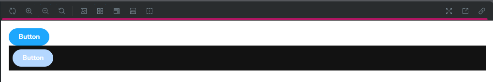

# Estilos Globales, Decorators para renderizar Light y Dark mode, herramienta en Toolbar📚

1. Vamos a empezar por ver acerca de los estilos globales, primero iremos a los estilos del componente `Button.tsx` y modificaremos el color de su fundo para que use una variable css que definiremos en `index.css`:

```css
.storybook-button--primary {
  background-color: var(--primary);
  color: white;
}
```

```css
:root {
  --primary: #1ea7fd;
}
```

2. Si revisamos en la pagina de Storybook notaremos que no aparece el boton, esta ahí pero el estilo no se aplica, esto es por que aún debemos decirle a Storybook que debe usar los estilos globales, para ello vamos a la configuración de `preview.ts` y agregamos lo siguiente:

```typescript
import '../src/index.css'
```

3. Ahora veremos que todos los estilos del index afectan a nuestro boton.

> [!NOTE]
> Otros estilos que tengas en tu index también podrian afectar a como se ve en el canvas el componente, notese eso si dejamos los estilos que vite genera por defecto en `index.css`, para evitarlo simplemente borra los estilos que no necesitas.

# Decorators

Para más información visita la documentación de [decorators](https://storybook.js.org/docs/writing-stories/decorators).

---

Los **decorators** en Storybook son una funcionalidad que permite envolver las historias de un componente con un contexto adicional o lógica que modifica su apariencia o comportamiento. Funcionan como un "envoltorio" que aplica configuraciones globales o específicas a una o varias historias.

Esto es útil para:
- **Añadir estilos comunes** a las historias (por ejemplo, un tema).
- **Proveer contextos** como `React Context` o un proveedor de estado global como Redux.
- **Agregar lógica de configuración** como internacionalización (i18n) o manejo de datos ficticios.
- **Mockear APIs** o datos externos.

---

### ¿Para qué sirven los decorators?

1. **Reutilización de código común**: Puedes evitar duplicar configuraciones repetidas entre historias.
2. **Pruebas consistentes**: Proveen un entorno controlado y predecible para pruebas.
3. **Simplicidad y organización**: Mantienen las historias limpias y enfocadas en el componente en sí, delegando configuraciones adicionales a los decorators.

---

### Tipos de Decorators

1. **Global decorators**: Aplican configuraciones a todas las historias dentro de Storybook.
2. **Local decorators**: Se aplican a una sola historia o a un conjunto específico de historias.

---

### Configuración de Decorators

#### 1. **Decorators Globales**
Los globales se configuran en el archivo `preview.js` o `preview.ts`.

```js
// .storybook/preview.js
import { ThemeProvider } from 'styled-components';
import { myTheme } from '../src/themes';

export const decorators = [
  (Story) => (
    <ThemeProvider theme={myTheme}>
      <div style={{ padding: '20px', backgroundColor: '#f3f3f3' }}>
        <Story />
      </div>
    </ThemeProvider>
  ),
];
```

En este ejemplo:
- El componente `Story` representa la historia que se está renderizando.
- El `ThemeProvider` proporciona un tema global a todas las historias.

#### 2. **Decorators Locales**
Se configuran en el archivo de historia de un componente (`.stories.js` o `.stories.ts`).

```jsx
import React from 'react';
import { ThemeProvider } from 'styled-components';
import { Button } from './Button';
import { myTheme } from '../themes';

export default {
  title: 'Components/Button',
  component: Button,
};

const CustomDecorator = (Story) => (
  <ThemeProvider theme={myTheme}>
    <div style={{ margin: '20px' }}>
      <Story />
    </div>
  </ThemeProvider>
);

export const Primary = (args) => <Button {...args} />;
Primary.decorators = [CustomDecorator];
```

En este ejemplo:
- Solo la historia `Primary` usa el decorador `CustomDecorator`.
- Es útil cuando un componente necesita un contexto único.

---

### Recomendaciones al usar Decorators

1. **Mantén los decorators simples**:
   - Evita lógica compleja o dependencias pesadas en los decorators.
   - Mantén su propósito claro: estilos, contexto o pruebas.

2. **Usa globales para configuraciones comunes**:
   - Por ejemplo, estilos globales, temas o contextos compartidos como Redux o Apollo.

3. **Opta por locales para configuraciones específicas**:
   - Cuando solo una historia necesita un entorno especial.

4. **Divide responsabilidades**:
   - Si tienes múltiples contextos (temas, estado, datos simulados), considera usar varios decorators.

5. **Mockeo en decorators**:
   - Úsalos para mockear servicios o dependencias externas sin afectar el componente.

---

### Ejemplos Prácticos

#### 1. **Decorator para React Context**
```jsx
import { MyContextProvider } from '../src/context';

export const decorators = [
  (Story) => (
    <MyContextProvider value={{ user: 'John Doe', loggedIn: true }}>
      <Story />
    </MyContextProvider>
  ),
];
```

#### 2. **Decorator para i18n**
```jsx
import { I18nextProvider } from 'react-i18next';
import i18n from './i18n';

export const decorators = [
  (Story) => (
    <I18nextProvider i18n={i18n}>
      <Story />
    </I18nextProvider>
  ),
];
```

#### 3. **Mockeo con Decorators**
```jsx
export const decorators = [
  (Story) => {
    window.fetch = jest.fn(() =>
      Promise.resolve({
        json: () => Promise.resolve({ data: 'Mocked Data' }),
      })
    );
    return <Story />;
  },
];
```

---

# Agregando Decorators a nuestra practica

1. Como los decorators se suelen crear con sintaxis de JSX vamos a cambiar la extensión de nuestro ToDo.stories.ts a .tsx
2. Ahora en el objeto `meta` vamos a agregar algo simple y visual para que veamos con más claridad como funciona:

```jsx
const meta = {
  title: 'Components/ToDo',
  component: ToDo,
  args: {
    id: '1',
    todo: 'Hello World',
  },
  decorators: [
    (Story) => (
      <div style={{ border: '1px solid black', padding: '20px' }}>
        <Story />
      </div>
    ),
  ],
} satisfies Meta<typeof ToDo>
```

3. Revisando en la pagina de Storybook podemos ver como nuestro ToDo esta envuelto en un div con el estilo de un borde y padding.
4. Podemos agregar más de uno:

```jsx
decorators: [
  (Story) => (
    <div style={{ border: '1px solid black', padding: '20px' }}>
      <Story />
    </div>
  ),
  (Story) => (
    <div style={{ border: '2px solid red', padding: '10px' }}>
      <Story />
    </div>
  ),
],
```

5. Revisa que cambia en la pagina de Storybook.
6. Vamos ampliar el ejemplo dandole un modo obscuro, empezando por modificar nuestro archivo `index.css` para que use un tema oscuro:

```css
:root {
  --primary: #1ea7fd;
  --text: black;
  --grey: #eee;
}

.dark-theme {
  background-color: #121212;
  --primary: #b4d7ff;
  --text: white;
  --grey: #282828;
}
```

7. Vamos a modificar un poco los estilos del ToDo:

```css
.completed {
  text-decoration: line-through;
}

.toDo {
  background: var(--grey);
  padding: 0.5rem;
  color: var(--text);
}
```

8. Vamos a nuestro componente y agreamos la clase:

```jsx
const ToDo = ({ id, todo, isDone }: ToDoProps) => {
  const [completed, setCompleted] = useState(isDone)

  return (
    <div className={styles.toDo}> {/* Agregamos la clase */}
      <input
        type='checkbox'
        id={id}
        checked={completed}
        onChange={() => setCompleted(!completed)}
      />
      <span className={completed ? styles.completed : ''}>{todo}</span>
    </div>
  )
}
```

9. Finalmente modificamos un poco el decorator:

```jsx
decorators: [
  (Story) => (
    <div>
      <Story />
      <div className='dark-theme' style={{padding: '.5rem'}}>
        <Story />
      </div>
    </div>
  ),
],
```

10. Revisamos que cambia en la pagina de Storybook.
11. Podemos aplicarlos de manera global, para ello movemos el decorator que tenemos a el archivo `preview.ts`, cambiamos su nombre a `preview.tsx` e importamos React para que no nos de errores:

```jsx
import type { Preview } from '@storybook/react'
import '../src/index.css'
import React from 'react'

const preview: Preview = {
  parameters: {
    controls: {
      matchers: {
        color: /(background|color)$/i,
        date: /Date$/i,
      },
    },
  },
  decorators: [
    (Story) => (
      <div>
        <Story />
        <div className='dark-theme' style={{padding: '.5rem'}}>
          <Story />
        </div>
      </div>
    ),
  ],
}

export default preview
```

12. Revisamos que cambia en la pagina de Storybook.
13. Notamos que en los previews de Storybook tenemos tanto el componente con tema light como el con tema dark, pero puede que no queramos eso, si no tenerlos por separado, para ello vamos a realizar algunos cambios.
14. Primero notemos la barra con herramientas que aparece en la parte superior de los previews: <br/> 
15. También podemos revisar la documentación: [link](https://storybook.js.org/docs/essentials/toolbars-and-globals#global-types-and-the-toolbar-annotation)
16. Ahora iremos a nuestro archivo `preview.tsx` y agregamos lo siguiente:

```jsx
const preview: Preview = {
  parameters: {
    controls: {
      matchers: {
        color: /(background|color)$/i,
        date: /Date$/i,
      },
    },
  },
  // agregado
  globalTypes: {
    theme: {
      description: 'Dark or Light Theme',
      toolbar: {
        title: 'Theme',
        icon: 'circlehollow',
        items: ['light', 'dark', 'both'],
        dynamicTitle: true,
      },
    },
  },
  // agregado
  initialGlobals: {
    theme: 'light',
  },
}
```

17. Si vamos a la pagina de Storybook notaremos que ya aparece el icono con las opciones que le dimos, pero da igual cual seleccionemos, ninguna va a funcionar, aún debemos completar esa parte.
18. Para que termine de funcionar debemos modificar el decorator:

```jsx
decorators: [
  (Story, context) => {
    const { theme } = context.globals

    if (theme === 'light') {
      return <Story />
    }

    if (theme === 'dark') {
      return (
        <div className='dark-theme' style={{ padding: '.5rem' }}>
          <Story />
        </div>
      )
    }

    return (
      <div>
        <Story />
        <div className='dark-theme' style={{ padding: '.5rem' }}>
          <Story />
        </div>
      </div>
    )
  },
],
```

19. Finalmente probamos que efectivamente ya funciona el botón de tema que agregamos al toolbar.