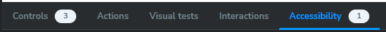
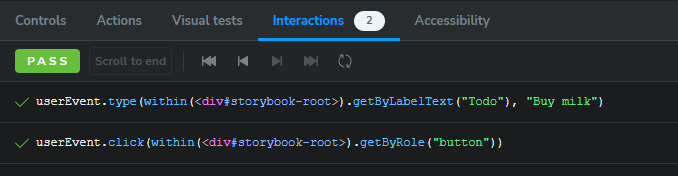

# Extensión de accesibilidad y testing 📚

## A11y Addon

El **A11y Addon** de Storybook es una herramienta diseñada para realizar pruebas de accesibilidad (a11y) en tus componentes. Facilita la detección de problemas de accesibilidad directamente en las historias de Storybook, ayudándote a garantizar que tus componentes cumplan con las mejores prácticas y estándares como **WCAG (Web Content Accessibility Guidelines)**.

El A11y Addon es una integración con la biblioteca **axe-core**, que analiza los componentes en busca de problemas de accesibilidad como:
- Contraste insuficiente.
- Falta de etiquetas ARIA.
- Errores en los roles de los elementos.
- Problemas con el orden del DOM.
- Elementos interactivos que no son accesibles.

---

### **Ventajas de usar el A11y Addon**

1. **Integración directa con Storybook**: No necesitas configurar herramientas externas.
2. **Feedback en tiempo real**: Identifica problemas en el momento en que trabajas con tus historias.
3. **Compatibilidad con otros addons**: Funciona junto con addons como `Controls` o `Actions`.
4. **Configuración flexible**: Puedes personalizar las reglas de análisis para tu proyecto.

---

### Instalación del Addon A11y

Primero, instala el addon:

```bash
npm install @storybook/addon-a11y --save-dev
```

Luego, habilítalo en la configuración de Storybook:

1. Abre o crea el archivo `.storybook/main.js`.
2. Agrega `@storybook/addon-a11y` a la lista de addons:

```javascript
module.exports = {
  addons: ['@storybook/addon-a11y'],
};
```

Reinicia Storybook para aplicar los cambios.

---

### **Uso del Addon A11y**

#### 1. **Revisión Automática**
Una vez instalado, encontrarás una pestaña llamada **"Accessibility"** en el panel inferior de Storybook. Cuando abras una historia:
- El addon analizará automáticamente el componente renderizado.
- Te mostrará problemas categorizados como **violations**, **passes**, **incomplete** o **best practices**.

#### 2. **Decorador para Probar Accesibilidad**
Puedes agregar el decorador `withA11y` globalmente para habilitar la revisión en todas las historias:

```javascript
// .storybook/preview.js
import { withA11y } from '@storybook/addon-a11y';

export const decorators = [withA11y];
```

Esto asegura que todas las historias sean revisadas por el addon A11y.

#### 3. **Configuración de Reglas**
Puedes personalizar qué reglas aplicar o excluir en tu configuración:

```javascript
// .storybook/preview.js
import { withA11y } from '@storybook/addon-a11y';

export const decorators = [withA11y];

export const parameters = {
  a11y: {
    config: {
      rules: [
        {
          id: 'color-contrast',
          enabled: true, // Activa o desactiva una regla específica.
        },
      ],
    },
  },
};
```

#### 4. **Accesibilidad en Historias Específicas**
Si solo deseas revisar accesibilidad en una historia en particular:

```javascript
import { Button } from './Button';

export default {
  title: 'Components/Button',
  component: Button,
  parameters: {
    a11y: {
      // Configuración específica para esta historia
      config: {
        rules: [{ id: 'color-contrast', enabled: false }],
      },
    },
  },
};

export const Primary = (args) => <Button {...args} />;
```

---

### Ejemplo Práctico

Supongamos que tienes un componente de botón:

```jsx
import React from 'react';

export const Button = ({ label }) => (
  <button style={{ backgroundColor: '#ccc', color: '#fff' }}>
    {label}
  </button>
);
```

Si el contraste entre el fondo y el texto no es suficiente, el addon lo detectará y mostrará algo como:

```
Violation: Element has insufficient color contrast.
Fix: Ensure the contrast ratio is at least 4.5:1 for normal text.
```

---

### **Configuración Avanzada**

#### Ignorar Problemas Específicos

Puedes deshabilitar reglas globales si son irrelevantes para tu proyecto:

```javascript
export const parameters = {
  a11y: {
    config: {
      rules: [
        { id: 'landmark-one-main', enabled: false },
      ],
    },
  },
};
```

#### Ejecutar Manualmente el Análisis

Si no deseas análisis automático, puedes usar el addon manualmente desde el panel de accesibilidad para una revisión puntual.

---

### Recomendaciones

1. **Integra accesibilidad desde el inicio**:
   - Detectar problemas temprano reduce costos y esfuerzo.
2. **Crea historias accesibles por defecto**:
   - Asegúrate de que los componentes sean funcionales con teclado y lectores de pantalla.
3. **Personaliza las reglas**:
   - Adapta las pruebas según las necesidades y estándares del proyecto.
4. **Prioriza las Violations**:
   - Enfócate primero en resolver las violaciones críticas.
5. **Usa herramientas complementarias**:
   - Combina el addon A11y con pruebas manuales usando herramientas como Lighthouse.

---

# Agregando A11y Addon al proyecto

1. Revisando la [documentación](https://storybook.js.org/docs/writing-tests/accessibility-testing), instalamos el addon A11y:

```bash
pnpm exec storybook add @storybook/addon-a11y
```

2. Verificamos que aparezca en el archivo `main.ts` de `.storybook`:

```ts
const config: StorybookConfig = {
  stories: ["../src/**/*.mdx", "../src/**/*.stories.@(js|jsx|mjs|ts|tsx)"],
  addons: [
    "@storybook/addon-onboarding",
    "@storybook/addon-essentials",
    "@chromatic-com/storybook",
    "@storybook/addon-interactions",
    "@storybook/addon-a11y" // <-- esto debe aparecer
  ],
}
```

3. Para verificar que todo está correcto deberíamos ver una nueva pestaña (Accessibility) en el panel inferior de los canvas de Storybook: <br/> 

> [!TIP]
> En caso de que no la veas, intenta reiniciar el proyecto, debería aparecer después de eso.

4. Si vamos a la story `Default` de nuestro componente `ToDo` nos aparecerá en la ventana de accesibilidad `1 Violations`, si leemos el mensaje nos indica que nos hace falta un label, por lo que vamos a agregarlo:

```jsx
// Componente ToDo.tsx
{
  return (
    <div className={styles.toDo}>
      <input
        type='checkbox'
        aria-label={title} // <-- agregamos esto
        id={id.toString()}
        checked={completed}
        onChange={() => setCompleted(!completed)}
      />
      <span className={completed ? styles.completed : ''}>{title}</span>
    </div>
  )
}
```

5. Vuelve a revisar la ventana de accesibilidad, ahora no debera aparecer ninguna violación.

---

# Testing

1. Vamos a nuestro componente `ToDoList` y añadimos la funcionalidad de agregar nuevos elementos a la lista:

```jsx
// Componente ToDoList.tsx
export const ToDoList = () => {
  const [todos, setTodos] = useState<ToDoProps[] | undefined>()
  const [error, setError] = useState<boolean>(false)

  useEffect(() => {
    fetch('https://jsonplaceholder.typicode.com/todos?_limit=10')
      .then((response) => response.json())
      .then((json) => setTodos(json))
      .catch(() => setError(true))
  }, [])

  const onSave = (event: React.FormEvent<HTMLFormElement>) => {
    event.preventDefault()

    const formData = new FormData(event.currentTarget)
    const title = formData.get('todo') as string

    if (!title) return

    const newTodo: ToDoProps = {
      id: (todos?.length || 0) + 1,
      title,
      completed: false,
    }

    setTodos([newTodo, ...(todos || [])])
    event.currentTarget.reset()
  }

  return (
    <div>
      <h1>Todo List</h1>
      <form onSubmit={onSave}>
        <label htmlFor='todo'>Todo</label>
        <input type='text' name='todo' id='todo' />
        <Button label='Guardar' primary type='submit' />
      </form>
      {error && <h1>Error, intenta más tarde</h1>}
      {todos?.map((item) => (
        <ToDo {...item} />
      ))}
    </div>
  )
}
```

2. Verificamos en la pagina de storybook que funciona nuestro formulario de agregar nuevos elementos a la lista.
3. Aquí es donde entra el concepto de **play**, para saber más podemos ve la documentación de [Play function](https://storybook.js.org/docs/writing-stories/play-function).
4. Ahora vamos a nuestro archivo `ToDoList.stories.tsx` y añadimos el test para que se añada un nuevo elemento a la lista, similar a cypress:

```jsx
import { userEvent, within } from '@storybook/test'

const meta = {
  title: 'Components/ToDoList',
  component: ToDoList,
  // agregamos el play
  play: async ({ canvasElement }) => {
    const canvas = within(canvasElement)
    const todoInput = canvas.getByLabelText('Todo')
    await userEvent.type(todoInput, 'Buy milk')

    const saveButton = canvas.getByRole('button')
    await userEvent.click(saveButton)
  },
  parameters: {
    msw: {
      handlers: [
        http.get('https://jsonplaceholder.typicode.com/todos?_limit=10', () => {
          return HttpResponse.json(todos)
        }),
      ],
    },
  },
} satisfies Meta<typeof ToDoList>
```

5. Ahora volvemos a la pagina de storybook y deberíamos ver en la pestaña inferior de nombre `Interactions` el test que acabamos de añadir: <br/> 
6. Incluso podemos agregar el conocido `expect`, para ello modificamos un poco el test:

```jsx
import { expect, userEvent, within } from '@storybook/test'

play: async ({ canvasElement }) => {
  const canvas = within(canvasElement)
  const todoInput = canvas.getByLabelText('Todo')
  await userEvent.type(todoInput, 'Buy milk')

  const saveButton = canvas.getByRole('button')
  await userEvent.click(saveButton)

  const newTodo = canvas.getByText('Buy milk')
  await expect(newTodo).toBeInTheDocument()
},
```

7. Ahora volvemos a la pagina de storybook y verificamos que pase el expect que agregamos.

---